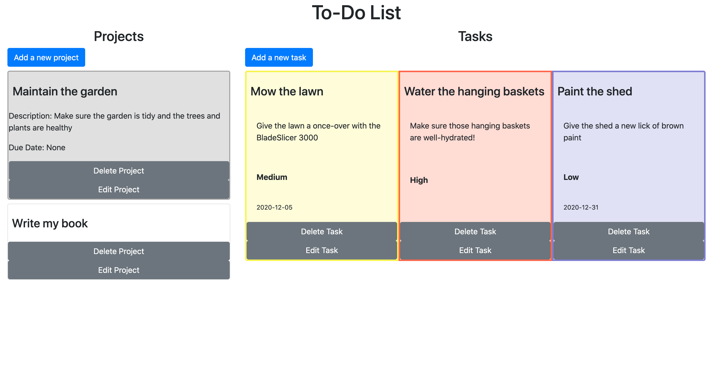
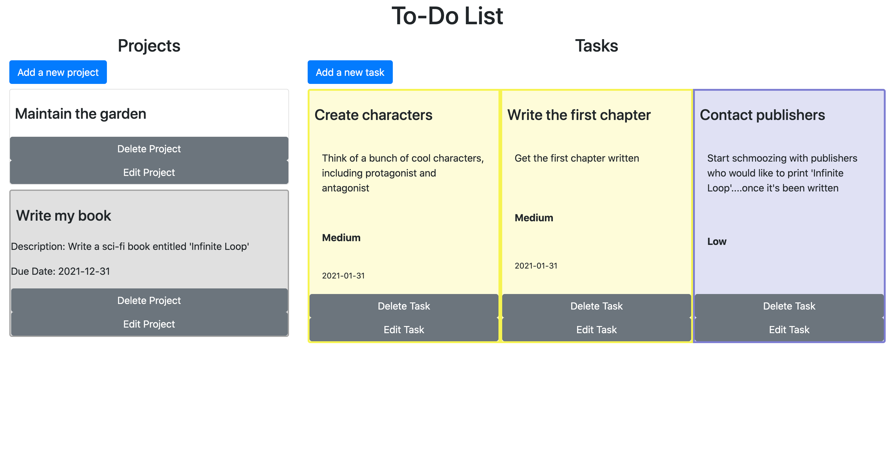

# To-Do List

> This project is a web-based to-do list application and was built as part of Microverse's JavaScript module.

> With this To-Do List app, the user can create projects and tasks which belong to those projects. Tasks and projects have "Due Dates" and tasks have priorities, which are color-coded in the app's UI.

## Live Demo

**Want to check out our work for yourself? Take a look at the [Live Demo](https://raw.githack.com/epinczinger/to-do-list/feature/working-branch/dist/index.html
).**

## Built With

- JavaScript
- npm (Node Package Manager)
- Webpack
- Sass
- Bootstrap

## Getting Started

To get a local copy up and running follow these simple example steps.

### Prerequisites

### Setup

To set this project up locally, follow these simple instructions:

1. Open a Terminal and navigate to the location in your system where you would like to download the project. **New to Terminal? [Learn here](https://www.freecodecamp.org/news/conquering-the-command-line-f85f5e46c07c/).**

2. Enter the following line of code to clone this repository:

`git clone git@github.com:epinczinger/to-do-list.git`

3. Now that the repository has been cloned, navigate inside it using `cd to-do-list`.

4. The project's dependencies are managed by npm. To install them, enter the following line of code in the Terminal.

`npm install`

5. Congratulations! All necessary files have been installed. To view the website, just open 'dist/index.html' in a browser of your choosing.

## Author

👤 **Joseph Burke**

- Github: [@Joseph-Burke](https://github.com/Joseph-Burke)
- Twitter: [@__joeburke](https://twitter.com/__joeburke)
- LinkedIn: [Joseph Burke](https://www.linkedin.com/in/joseph-burke-b7a8261a5)

👤 **Esteban Pinczinger**

- Github: [@epinczinger](https://github.com/epinczinger)
- Twitter: [@epinczinger](https://twitter.com/epinczinger)
- LinkedIn: [Esteban Pinczinger](https://www.linkedin.com/in/esteban-pinczinger)

## 🤝 Contributing

Contributions, issues and feature requests are welcome!

Feel free to check the [issues page](issues/) and add an issue if you see room for improvement.

## Show your support

Give a ⭐️ if you like this project!

## Acknowledgments

- Many thanks to all of my peers and colleagues from Microverse.
- This assignment was taken from [The Odin Project](https://www.theodinproject.com/home)'s Web Development course, which is available for free.

## 📝 License

This project is [MIT](lic.url) licensed.
